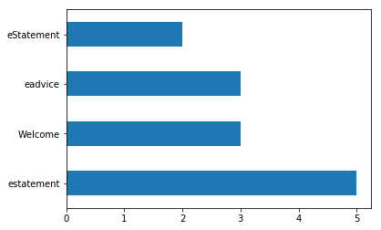

```python
from pandas import DataFrame, Series
import numpy as np, pandas as pd, os, warnings
```


```python
path="ESR.csv";
recs=pd.read_csv(path)
recs[:5]
```


<table border="1" class="dataframe">
  <thead>
    <tr style="text-align: right;">
      <th></th>
      <th>lob</th>
      <th>date</th>
      <th>type</th>
    </tr>
  </thead>
  <tbody>
    <tr>
      <th>0</th>
      <td>cbol</td>
      <td>2019-04-11</td>
      <td>estatement</td>
    </tr>
    <tr>
      <th>1</th>
      <td>cbol</td>
      <td>2019-04-11</td>
      <td>eadvice</td>
    </tr>
    <tr>
      <th>2</th>
      <td>qcc</td>
      <td>2019-04-12</td>
      <td>Welcome</td>
    </tr>
    <tr>
      <th>3</th>
      <td>scp</td>
      <td>2019-04-11</td>
      <td>eStatement</td>
    </tr>
    <tr>
      <th>4</th>
      <td>cbol</td>
      <td>2019-04-11</td>
      <td>estatement</td>
    </tr>
  </tbody>
</table>
</div>


```python
df=DataFrame(recs)
```


```python
df['type'][:5]
```


    0    estatement
    1       eadvice
    2       Welcome
    3    eStatement
    4    estatement
    Name: type, dtype: object


```python
type_cnts=df['type'].value_counts()
```


```python
type_cnts
```


    estatement    5
    Welcome       3
    eadvice       3
    eStatement    2
    Name: type, dtype: int64


```python
from collections import Counter
```


```python
counts=Counter(df['type'])
```


```python
counts
```


    Counter({'estatement': 5, 'eadvice': 3, 'Welcome': 3, 'eStatement': 2})


```python
counts.most_common(2)
```


    [('estatement', 5), ('eadvice', 3)]


```python
df['type'].value_counts().plot(kind='barh')
```


    <matplotlib.axes._subplots.AxesSubplot at 0x7fd3bc143f98>





```python

```
