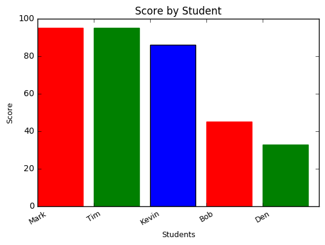

# Pandas Demo

- Below is an example of using numpy and pandas to create data frames, then display with matplotlib
- Showing how to split the dataframe by element, or criteria as well as list-wise operations
- Lastly performing graphing with matplotlib and coloring bars with different colors


```python
import numpy as np
import pandas as pd
import matplotlib.pyplot as plt
```


```python
students = pd.DataFrame({'Score': [95, 95, 86, 45, 33]},index=["Mark","Tim", "Kevin", "Bob", "Den"])
```


```python
students
```


<div>
<table border="1" class="dataframe">
  <thead>
    <tr style="text-align: right;">
      <th></th>
      <th>Score</th>
    </tr>
  </thead>
  <tbody>
    <tr>
      <th>Mark</th>
      <td>95</td>
    </tr>
    <tr>
      <th>Tim</th>
      <td>95</td>
    </tr>
    <tr>
      <th>Kevin</th>
      <td>86</td>
    </tr>
    <tr>
      <th>Bob</th>
      <td>45</td>
    </tr>
    <tr>
      <th>Den</th>
      <td>33</td>
    </tr>
  </tbody>
</table>
</div>


```python
students.head(1)
```


<div>
<table border="1" class="dataframe">
  <thead>
    <tr style="text-align: right;">
      <th></th>
      <th>Score</th>
    </tr>
  </thead>
  <tbody>
    <tr>
      <th>Mark</th>
      <td>95</td>
    </tr>
  </tbody>
</table>
</div>


```python
students.Score>90
```


    Mark      True
    Tim       True
    Kevin    False
    Bob      False
    Den      False
    Name: Score, dtype: bool


```python
students[students.Score>90]
```


<div>
<table border="1" class="dataframe">
  <thead>
    <tr style="text-align: right;">
      <th></th>
      <th>Score</th>
    </tr>
  </thead>
  <tbody>
    <tr>
      <th>Mark</th>
      <td>95</td>
    </tr>
    <tr>
      <th>Tim</th>
      <td>95</td>
    </tr>
  </tbody>
</table>
</div>


```python
students.Score *.9 # display scores - dropped by 10%
```


    Mark     85.5
    Tim      85.5
    Kevin    77.4
    Bob      40.5
    Den      29.7
    Name: Score, dtype: float64


```python
index = np.arange(len(students))
barlist=plt.bar(index, students.Score, color=(0, 0, 1))
barlist[0].set_color('r')
barlist[1].set_color('g')
barlist[3].set_color('r')
barlist[4].set_color('g')
plt.xlabel('Students', fontsize=9)
plt.ylabel('Score', fontsize=9)
plt.xticks(index, students.index, fontsize=9, rotation=30)
plt.title('Score by Student')
plt.show()

```





```python

```
